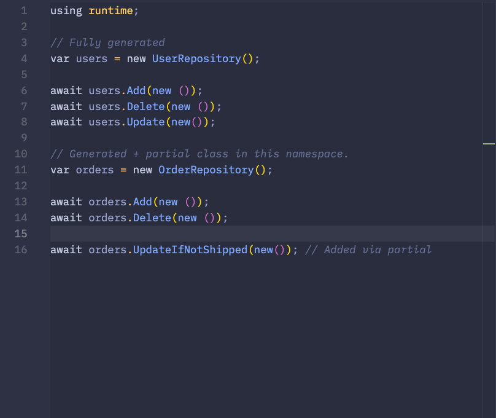

# .NET Source Generators with .NET 7

.NET source generators provide a framework level utility to dynamically generate source code.  Whether that's whole classes, individual functions (using C# partial classes), or strongly-typed runtime bindings.

Aside from the release of LINQ and `System.Linq.Expressions` to support it, source generators are one of the key .NET platform meta-features.

In this exercise, we'll explore source generators in the context of building a data access layer that allows us to dramatically reduce some of the more tedious, boiler-plate work of building a data access layer.

## Problem Outline

The Repository pattern is particularly suited to working with document-oriented databases like Firestore and CosmosDB since each document represents a self-encapsulated entity.  In general, because of this alignment, it is often enough to write a simple generic repository class that acts as a gateway to the underlying database.

However, because of the limitations of document-oriented databases, complex operations may often require writing custom concrete implementations per-type like `OrderRepository: RepositoryBase<Order>`.

This approach allows us to extend `Order` specific operations in a well encapsulated manner and in fact, it would be nice if we had an entity specific repository for each entity type in our domain space.

As the number of entity types increases, this can easily become tedious! With Roslyn-powered .NET source generators, we can automate away this tedium this while still retaining flexibility.

## The Domain Space

Consider the following simple domain model and data access contract:

```cs
namespace runtime;

public interface IRepository<T> where T: Entity {
  Task Add(T Entity);

  Task Delete(T Entity);

  Task Update(T Entity);
}

public abstract class RepositoryBase<T> : IRepository<T> where T: Entity {
  public virtual async Task Add(T Entity) {
    await Task.CompletedTask;
    Console.WriteLine($"Added → {typeof(T).Name}");
  }

  public virtual async Task Delete(T Entity) {
    await Task.CompletedTask;
    Console.WriteLine($"Deleted → {typeof(T).Name}");
  }

  public virtual async Task Update(T Entity) {
    await Task.CompletedTask;
    Console.WriteLine($"Updated → {typeof(T).Name}");
  }
}

public abstract class Entity { }

public class User : Entity { }

public class Order : Entity { }
```

Given this `IRepository<T>` contract, the `RepositoryBase<T>` class can cover most of our common CRUD cases, but we'd then have to create a `UserRepository : RepositoryBase<User>` and `OrderRepository<Order>`.  This can become tedious as our entity domain space increases.

To work around this, we can leverage .NET source generators to create the entity repositories for us!

To get started, we'll create two projects:

1. `runtime` - this is our application runtime where our own code goes and where we'll have the base definition of our domain model and data access layer.
2. `generator` - this is where we'll place our code generator.

If you're following along with VS Code:

```shell
mkdir dn7-src-gen
cd dn7-src-gen
dotnet add sln            # Create the solution file
mkdir generator
mkdir runtime
cd generator
dotnet new classlib      # Class library project type for the generator
cd ../runtime
dotnet new console       # Console project type for our runtime app
cd ../
dotnet sln add runtime
dotnet sln add generator
```

## Creating the Generator

When creating a generator, you'll want to create a separate project to be referenced by your main project.

Here is the `.csproj` file for the generator project:

```xml
<Project Sdk="Microsoft.NET.Sdk">
  <PropertyGroup>
    <TargetFramework>net7.0</TargetFramework>
    <EnforceExtendedAnalyzerRules>true</EnforceExtendedAnalyzerRules>
  </PropertyGroup>
  <ItemGroup>
    <PackageReference Include="Microsoft.CodeAnalysis.Analyzers" Version="3.3.4">
      <IncludeAssets>runtime; build; native; contentfiles; analyzers; buildtransitive</IncludeAssets>
      <PrivateAssets>all</PrivateAssets>
    </PackageReference>
    <PackageReference Include="Microsoft.CodeAnalysis.Analyzers" Version="4.6.0" />
  </ItemGroup>
</Project>
```

> 💡 Note that [while the documentation mentions](https://learn.microsoft.com/en-us/dotnet/csharp/roslyn-sdk/source-generators-overview#get-started-with-source-generators) that the project needs to target `netstandard2.0`, it means that any .NET 5 and above target will also work.

We need to add two references:

```shell
cd generator
dotnet add package Microsoft.CodeAnalysis.CSharp
dotnet add package Microsoft.CodeAnalysis.Analyzers
```

There are two parts to our generator:

1. A receiver that handles accumulating our target entity classes.
2. A generator which uses the accumulated entity classes to generate repositories.

The first is a very simple `ISyntaxContextReceiver`.  You can think of it like a listener that handles each node as the syntax tree is traversed.  In our case, what we want to do is to find all of the classes which implement the `Entity` base class:

```cs
/// <summary>
/// This will receive each "syntax context" to determine if we want to act on it.
/// Here, we'll capture a list of models that implement Entity.
/// </summary>
public class RepoSyntaxReceiver : ISyntaxContextReceiver {
  public List<string> Models = new();

  public void OnVisitSyntaxNode(GeneratorSyntaxContext context) {
    if (context.Node is not ClassDeclarationSyntax classDec
      || classDec.BaseList == null) {
      return;
    }

    // If the base class list has Entity, we want to generate a repo for it!
    if (classDec.BaseList.Types.Any(t => t.ToString() == "Entity")) {
      Models.Add(classDec.Identifier.ToString());
    }
  }
}
```

Once we've collected the entity class names, we want to generate a repository file for each one.  This is where our generator comes into play:

```cs
/// <summary>
/// This is our generator that actually outputs the source code.
/// </summary>
[Generator]
public class RepoGenerator : ISourceGenerator {
  /// <summary>
  /// We hook up our receiver here so that we can access it later.
  /// </summary>
  public void Initialize(GeneratorInitializationContext context) {
    context.RegisterForSyntaxNotifications(() => new RepoSyntaxReceiver());
  }

  /// <summary>
  /// And consume the receiver here.
  /// </summary>
  public void Execute(GeneratorExecutionContext context) {
    var models = (context.SyntaxContextReceiver as RepoSyntaxReceiver).Models;

    foreach (var modelClass in models) {
      var src = $@"
using System;

namespace runtime;

public partial class {modelClass}Repository : RepositoryBase<{modelClass}> {{ }}";

      context.AddSource($"{modelClass}Repository.g.cs", src);
    }
  }
```

For our domain space, this will generate classes like:

```cs
public partial class OrderRepository : RepositoryBase<Order> { };
public partial class UserRepository : RepositoryBase<Order> { };
```

Take note that we've declared these as `partial` classes; we'll explore this in a bit.

## Using the Generator

From our runtime project -- the one that contains our actual code -- we can now reference these generated classes by updating our `runtime.csproj` file:

```xml
<Project Sdk="Microsoft.NET.Sdk">
  <PropertyGroup>
    <OutputType>Exe</OutputType>
    <TargetFramework>net7.0</TargetFramework>
    <ImplicitUsings>enable</ImplicitUsings>
    <Nullable>enable</Nullable>
  </PropertyGroup>
  <ItemGroup>
    <ProjectReference
      Include="../generator/generator.csproj"
      OutputItemType="Analyzer"
      ReferenceOutputAssembly="false" />
  </ItemGroup>
</Project>

```

And consuming them is without fanfare:

```cs
using runtime;

var users = new UserRepository();

await users.Add(new ());
await users.Delete(new ());
await users.Update(new());

var orders = new OrderRepository();

await orders.Add(new ());
await orders.Delete(new ());
await orders.Update(new());
```

## Extending the Generated Repository

This is incredibly handy and has many use cases!  But if we only needed the basic, common CRUD operations, a generic `Repository<T>` would have been sufficient.  The purpose of creating a strongly typed instance is to provide a well-encapsulated place to organize model-specific operations.

For example, what if we want to implement an operation on `Order` like `UpdateIfNotShipped`?  Because we're using [partial classes](https://learn.microsoft.com/en-us/dotnet/csharp/programming-guide/classes-and-structs/partial-classes-and-methods), we can easily extend our generated repositories:

```cs
/// <summary>
/// A partial class that extends the generated class.
/// </summary>
public partial class OrderRepository {

  /// <summary>
  /// This method doesn't exist in the contract, but we can extend the generated
  /// code using partial classes to add model-scoped behavior.
  /// </summary>
  public async Task UpdateIfNotShipped(
    Order entity
  ) {
    await Task.CompletedTask;
    Console.WriteLine("Order → UpdateIfNotShipped");
  }
}
```

Now our runtime code can look like this:

```cs
using runtime;

// Fully generated
var users = new UserRepository();

await users.Add(new ());
await users.Delete(new ());
await users.Update(new());

// Generated + partial class in this namespace.
var orders = new OrderRepository();

await orders.Add(new ());
await orders.Delete(new ());
await orders.Update(new());
await orders.UpdateIfNotShipped(new()); // Added via partial
```

## Dev Experience

A key question is how is the dev experience?  You can see that even in VS Code, we have full autocomplete support for our generated class:



And note the last line:

```cs
await orders.UpdateIfNotShipped(new()); // Added via partial
```

Our local, partial class allows us to extend the generated model as well.

## A Note on Caching

You may run into issues with caching while developing your own generators.  To work around this, you can use the `build-server shutdown` command to effectively restart the build server:

```shell
cd runtime

# Reset the build server to clear cache.
dotnet build-server shutdown
dotnet run

# Or combine:
dotnet build-server shutdown && dotnet run
```

This should clear the cache if you are observing that your generated code isn't reflecting updates to your string template.

## Closing Thoughts

.NET source generators are a powerful platform capability that can be harnessed to reduce a lot of boilerplate code while still providing strongly-typed access.  For performance sensitive use cases where .NET native ahead-of-time compilation (AOT) can decrease startup times, using source generators instead of reflection is a necessary technique.

It's one of the many reasons that the .NET ecosystem is one of the best for building and delivering complex, high performance applications.

## Resources

- https://learn.microsoft.com/en-us/dotnet/csharp/roslyn-sdk/source-generators-overview
- https://wengier.com/SourceGeneratorPlayground/
- https://blog.devops.dev/net-source-generator-way-to-improve-performance-3a03bca7c6d
- https://khalidabuhakmeh.com/dotnet-source-generators-finding-class-declarations
- https://github.com/amis92/csharp-source-generators
- https://learn.microsoft.com/en-us/answers/questions/1184090/looking-for-assistance-clearing-the-cache-for-upda